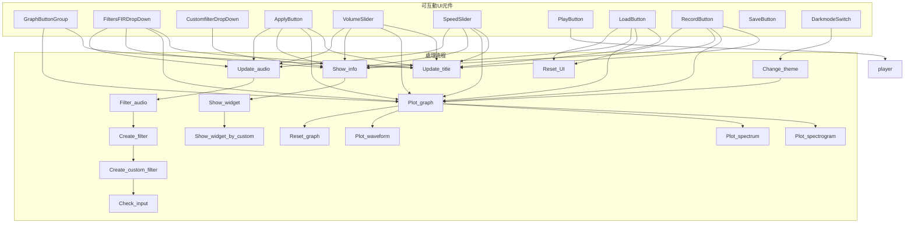

# Audio Filter

使用MATLAB App Designer開發的音訊分析與濾波應用  
主要功能為音訊視覺化、訊號調整（震幅、速度、濾波）  


> 目錄  
> [1. 檔案結構](#1-檔案結構)  
> [2. 使用說明](#2-使用說明)  
> [3. 主要功能](#3-主要功能)  
> [4. 未來延伸方向](#4-未來延伸方向)  
> [5. 參考資料](#5-參考資料)  
> [6. 版本紀錄](#6-版本紀錄)  
> [7. 執行畫面](#7-執行畫面)  

---

## 1. 檔案結構

```bash
Audio_filter/
├── Audio_filter/                    # MATLAB App安裝包
│   ├── for_redistribution/          
│       └── MyAppInstaller_web       # 安裝用的主程式
├── Legacy/                          # 過去的版本的程式碼
│   ├── Version_0/                   # v0，全部用.m檔畫
│   │   ├── createButtons.m          # v0，負責創造按鈕
│   │   ├── main.m                   # v0，主程式
│   │   ├── playAudio.m              # v0，負責播放音效
│   │   ├── plotGraphs.m             # v0，負責繪製圖表
│   │   ├── plotSpectrogram.m        # v0，負責繪製Spectrogram
│   │   └── readAudio.m              # v0，負責讀取音訊
│   ├── Version_1/
│   │   ├── Audio_filter_v1.mlapp    # v1，改成mlapp的主程式
│   │   └── Audio_filter_v1_code.m   # v1，展示程式碼用的.m檔
│   └── Version_2/
│       ├── Audio_filter_v2.mlapp    # v2，mlapp的主程式    
│       └── Audio_filter_v2_code.m   # v2，展示程式碼用的.m檔
├── Program/
│   ├── Audio_filter_v.mlapp         # v3，最終版本mlapp主程式
│   └── Audio_filter_v3_code.m       # v3，展示程式碼用的.m檔
└── Test_audio/                      # 測試用音訊
    └── Bird_singing.wav             

```
> [點此下載完整專案檔案](https://drive.google.com/drive/folders/1Ym4wv47xHs1qsiwbYdr8gWOBZ44WPJea?usp=sharing)

### 元件互動流程圖



---

## 2. 使用說明

1. 使用MATLAB開啟Audio_filter.mlapp並執行App（或啟動MyAppInstaller_web安裝app）
2. 載入或錄製音訊（未載入音訊就使用其他功能會顯示警告提示）
3. 進行音訊分析與編輯
4. 匯出編輯後的音訊並儲存

---

## 3. 主要功能

|類別|功能描述|
|:-----:|---------------------------------------|
|圖表切換|波形圖、頻譜圖、時頻譜，動態標題|
|濾波功能|包含內建的低通、高通、帶通、帶阻濾波器及自訂濾波器（含輸入防呆）|
|音訊編輯|使用拉桿調整音訊的音量、速度|
|播放控制|播放編輯後的音訊，附播放狀態指示燈|
|音訊管理|可讀取音訊（`.wav`檔）、錄製音訊、儲存編輯後的音訊|
|顏色主題|Dark mode / Light mode主題切換，保護眼睛|

### 介面說明


|物件|功能描述|
|:-----:|---------------------------------------|
|**Chart**|根據其他選項改變繪製資料、標題、顏色|
|**Graph**|選擇要觀察的圖表，預設為`Waveform`|
|**Filters (FIR)**|選擇要套用的濾波器，包含內建的`Low-pass`、`High-pass`、`Band-pass`、`Band-stop`和`Custom`，預設為`None`|
|**Custom filter**|選擇`Custom`選項時出現，選擇要使用的濾波器種類，預設為`Low-pass`|
|**Apply**|設定好自訂濾波器後，按下按鈕來套用濾波器|
|**Volume**|改變音訊的音量，預設為1x|
|**Speed**|改變音訊的速度，預設為1x|
|**Max Amplitude**|當前音訊的最大震幅|
|**SampleRate**|當前音訊的取樣率（觀察濾波器的限制）|
|**Times**|當前音訊的總時長（秒）|
|**Play statement**|播放狀態，預設為紅色（未播放）|
|**Play**|播放音訊|
| **Load**|讀取音訊|
|**Record**|錄製音訊（作為音訊輸入）|
|**Save**|儲存編輯後的音訊|
|**PassBandFrequency**|濾波器套用的參數|
|**StopBandFrequency**|濾波器套用的參數|
|**PassBandFrequency2**|（帶通、帶阻）濾波器套用的參數|
|**StopBandFrequency2**|（帶通、帶阻）濾波器套用的參數|
|**Dark mode**|切換介面主題|
> 備註：  
> Speed拉桿拉到0的話會強制設定成0.1x  
> SampleRate過高（>10000）或過低（<Nyquist frequency）時無法設定濾波器，會被強制關閉濾波器  

---

## 4. 未來延伸方向

|延伸項目|說明|
|:----------:|---------------------------------------------|
|段落選取|讓使用者選取音訊的其中某部分進行編輯、操作|
|撥放進度|播放時間顯示、進度條|
|暫停功能|新增暫停功能，不用每次都從頭播|
|編輯前後比較|新增一個圖表來比較編輯前後的音訊|
|儲存自訂參數|讓使用者可記憶上次使用的自訂濾波器參數|
|支援其他格式音訊檔案|如 `.mp3`, `.flac`|
|（進階）多組濾波器|使用多個濾波器|
|（進階）音訊種類分類|結合機器學習，把輸入的音訊歸類並推薦濾波器參數|
|（目標）相似音訊尋找|結合機器學習，試著做出小型Shazam !|

---

## 5. 參考資料

### Version 0 ~ 1：

[頻譜（spectrum）和頻譜圖（spectrogram）](https://ithelp.ithome.com.tw/articles/10228694)  

[Spectrogram - wikipedia](https://en.wikipedia.org/wiki/Spectrogram)

[擷取類比訊號：頻寬、奈奎斯特取樣定理與失真](https://www.ni.com/zh-tw/shop/data-acquisition/measurement-fundamentals/analog-fundamentals/acquiring-an-analog-signal--bandwidth--nyquist-sampling-theorem-.html?srsltid=AfmBOooBBJPaib_2_ASr67rTSgZ4qk8NX0GGTnNk3z2ceholHfDwlYpI)

[fft MATLAB Function Reference](http://mirlab.org/jang/books/matlabCommand/techdoc/ref/fft.html)

[使用MATLAB進行數位訊號處理簡介-第1部分](https://micro.rohm.com/tw/deviceplus/how-tos/arduino-guide/arduino-dsp-intro-to-digital-signal-processing-using-matlab-part-1/)

### Version 2 ~ 3

[designfilt - Design digital filters - MATLAB](https://ww2.mathworks.cn/help/signal/ref/designfilt.html)

[濾波器設計庫 - MATLAB & Simulink Example](https://ww2.mathworks.cn/help/signal/ug/filter-design-gallery.html)

[數位濾波器的學習筆記 Mr.pojenlai](https://pojenlai.wordpress.com/2016/04/10/%E6%95%B8%E4%BD%8D%E6%BF%BE%E6%B3%A2%E5%99%A8%E7%9A%84%E5%AD%B8%E7%BF%92%E7%AD%86%E8%A8%98/)

### 測試用音訊資料來源

[BBC Sound Effects](https://sound-effects.bbcrewind.co.uk/)  

---

## 6. 版本紀錄

### Version 0
- 使用.m手動繪製每個物件
- 包含讀取、繪製、播放功能
- 處理關閉畫面之後聲音還會繼續播的問題

### Version 1
- 改用App designer製作
- 修改介面樣式
- 新增音量和速度調整功能
- 處理圖表重製時Colobar會留下來，坐標軸方向會跑掉的問題

### Version 2
- 新增濾波器功能（只有內建濾波器）
- 用提示視窗取代Text
- 新增初始的讀取資料提示
- 處理未讀取資料時使用其他物件導致的錯誤
- 處理按了Load和Save卻cancael的狀況


### Version 3
- 修復Volume和Speed修改後濾波器被覆蓋的情況
- 把修改訊號數值的部分統整成一個函式，修改處理順序避免濾波器造成資料混亂
- 對濾波器的頻率進行限制（太小會無法建立濾波器、太大會處理太久當機）
- 新增多個提示視窗
- 新增自訂濾波器，讓使用者自己調整濾波器參數（包括輸入數值防呆）
- 新增動態圖表標題
- 修改整體顏色
- 新增Dark mode

---

## 7. 執行畫面

### ▸ White Theme Display


### ▸ Dark Theme Waveform


### ▸ Dark Theme Spectrum (with volume change)


### ▸ Dark Theme Spectrum (with speed change)


### ▸ Dark Theme Spectrum (with 4 types of filter)


